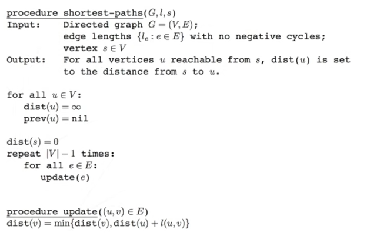

Dijkstra Theory:
https://www.youtube.com/watch?v=_lHSawdgXpI

Dijkstra's algorithm:
https://www.geeksforgeeks.org/dijkstras-shortest-path-algorithm-greedy-algo-7/

Other sources:
https://github.com/msambol/dsa/blob/master/shortest_path/dijkstras.py

notes:
 - greedy algorthim -> needs visited
 - doesn't work with loops
 - doesn't work with negative weight
 
---

Bellman-Ford theory:
https://www.youtube.com/watch?v=9PHkk0UavIM

Bellman-Ford applied:
https://www.youtube.com/watch?v=obWXjtg0L64

Bellman-Ford code:
https://www.geeksforgeeks.org/bellman-ford-algorithm-dp-23/

notes:
 - not greedy -> slower, but better output
 - doesn't work with loops
 - fine with negative weights

**Sudo code:**

---

Prim's algorthim (Minimum Spanning Tree):
https://www.youtube.com/watch?v=cplfcGZmX7I

Prim's algorithm code (edited Dijkstra):
https://www.geeksforgeeks.org/prims-minimum-spanning-tree-mst-greedy-algo-5/

notes:
 - changed dijkstra
